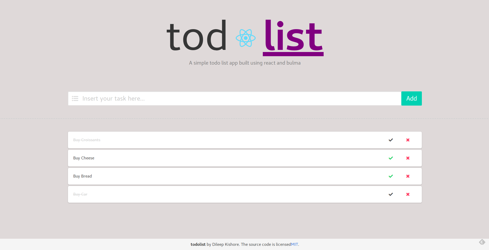

# React todo

An application made using react and bulma. [link](https://dileep-kishore.github.io/react-todo/)



>NOTE:
>This repo only contains the react frontend. The backend application is written using expressjs and uses mongodb as the database. It can be found [here](https://github.com/dileep-kishore/jquery-todo)

## Install

1. Install [npm](https://docs.npmjs.com/getting-started/installing-node)
2. Install the node packages
```sh
npm install
```
3. Run the server
```sh
npm start
```

## Credits
This project was bootstrapped with [Create React App](https://github.com/facebookincubator/create-react-app).